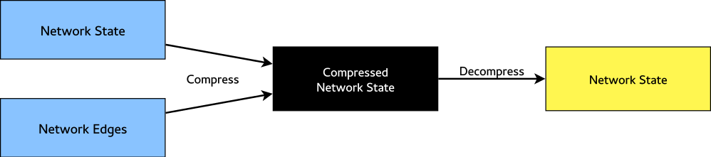

# Introduction

The purpose of this project is to compare competing approaches for network state
compression. The networks we are interested in have nodes with associated values
or *states*. Network state compression refers to the translation of these
states to a more compact form. For the compression methods we investigated, all
are lossy. Thus, we are mainly concerned about the accuracy and scalability of
the compression algorithms.

# Relevant Work

There are four papers relevant to this project:

 * Arlei Silva, Petko Bogdanov, Ambuj K. Singh. "Network State Summarization via
   In-Graph Compression". Under review, 2014.

    This paper introduces a new network state compression algorithm called Slice
    Tree. Two variants of this algorithm are given: greedy and sampling. These
    algorithms are detailed further in the next section.

 * David Shuman, et al. "[The Emerging Field of Signal Processing on Graphs:
   Extending high-dimensional data analysis to networks and other irregular
   domains.][signals]" Signal Processing Magazine, 2013.

    This paper introduces the concept of transforming network state into the
    signal domain.

 * Zachi Karni, and Craig Gotsman. "[Spectral Compression of Mesh
   Geometry.][spectral]" Proceedings of the 27th annual conference on Computer
   graphics and interactive techniques. ACM Press/Addison-Wesley Publishing Co.,
   2000.

 * David Hammond, Pierre Vandergheynst, and Remi Gribonval. "[Wavelets on Graphs
   via Spectral Graph Theory.][wavelets]" Applied and Computational Harmonic
   Analysis, 2011.

[signals]: http://dx.doi.org/10.1109/MSP.2012.2235192
[spectral]: http://dx.doi.org/10.1145/344779.344924
[wavelets]: http://dx.doi.org/10.1016/j.acha.2010.04.005

# Methods

In general, network state compression algorithms work like this:

The compression algorithm takes in the state of the network and its topology and
compresses the state into a format specific to the algorithm. The size (in
bytes) of the compressed state is determined by the *budget* passed to the
algorithm. For decompression, the algorithm translates the compressed state back
to the same format as what was passed in originally. Thus, there will be some
information loss after decompression. It is important to note that the topology
of the network is not compressed, only the values associated with each node.

The difference between the original network state and the network state produced
by the algorithm is said to be the *error*. This is measured as the [Sum of
Squared Errors (SSE)][SSE] and is computed by summing up the squared differences
between the original and decompressed node values.

[SSE]: http://en.wikipedia.org/wiki/Residual_sum_of_squares

We studied three different algorithms for network state compression. Most of our
time was spent studying Slice Tree and implementing the Spectral Graph Fourier
algorithm. The third algorithm, Spectral Graph Wavelets, was not studied in
great depth nor were we able to find or devise a working implementation under
our time constraints. Thus, information on this algorithm is sparse.

## Slice Tree

Slice Tree was created by Arlei Silva and described in his (currently
unpublished) paper "Network State Summarization via In-Graph Compression".

## Spectral Graph Fourier

## Spectral Graph Wavelets

# Datasets

We were provided with five real-world datasets to test the effectiveness of the
different methods on.

Three of these datasets were already processed and in the form of a network:

 * **Traffic**: A highway network of Los Angeles, CA with node values
   corresponding to average speeds at highway locations along time. For each
   time interval, there is a separate set of node values. These values are
   expected to be smooth across the topology of the network. This network
   consists of 1,923 nodes and 2,659 edges.

 * **Human**: A gene network for *Homo sapiens* with gene and protein
   interactions as edges and tissue expressions as node values. The number of
   nodes ranges from 540 to 3,178 and the number of edges range from 251 to
   6,856.

 * **DBLP**: An academic co-authorship network in which author are nodes and
   publication counts are values. An edge between nodes indicates co-authorship.
   This network consists of 1,291,210 nodes and 5,227,553 edges.

The other two datasets needed to be processed:

 * **Twitter**: This consists of all the raw tweets from June through December
   of 2009. Also included is a list of which users are following who. The raw
   tweets were processed to generate a network where nodes are users, a node's
   value is the average response time for that user to retweet another user's
   message, and an edge indicates that a user is following another user. Users
   who have not made any retweets are not included in the network. Similarly,
   retweets that do not exactly match the original message are also not factored
   in. The resulting network consists of 773,977 nodes and 465,150 edges.

 * **Wikipedia**: Only minor processing was needed for the Wikipedia dataset.
   Each node is an article, the node value is the total number of views for that
   article, and an edge means that one article links to another. The network
   state consists of view counts from the years 2008 through 2011. This network
   consists of 15,148,210 nodes and 2,434,781 edges.

These datasets are also documented in their respective directories under
`data/`.

Additionally, each of these datasets were reduced to 1000 nodes each. The script
that does this is `reduce.py` under `tools/`. It works by choosing a random node
(or center) from the network and doing a breadth-first search from that
location. This continues until the specified number of nodes are collected or if
the pool of nodes is exhausted. Then, the selected nodes and the edges between
them are written out to their respective `.data` and `.graph` files.

There is one major problem with this approach to reduction. For networks with
many small connected components (i.e., disconnected sub-networks), such as the
Wikipedia network, this results in networks with very few or no edges. Instead,
nodes should be drawn from the largest connected components first. However, due
to time constraints, this was never implemented.

# Experiments

## Scalability

## Accuracy

## Dataset Comparison

# Results and Analysis

# Future Experiments

# Future Work

## Outlier Detection

## Value Prediction

## Trend Analysis/Change
